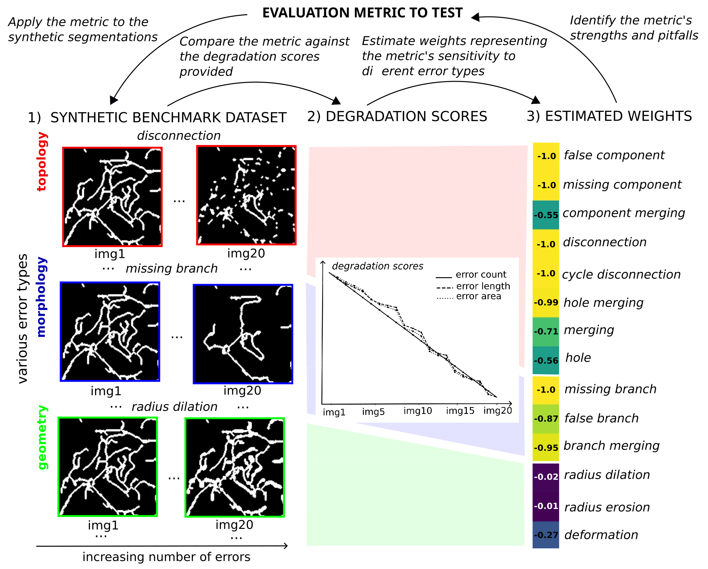

# BenchmarkTopoSegMetrics

Code to benchmark topology-aware segmentation evaluation metrics using synthetic predictions. Our paper has been accepted for an oral presentation at the MICCAI 2025 Shape in Medical Imaging Workshop, and received a Best Paper award!

## Repository overview

The **data** folder contains the benchmark dataset along with some toy data that can be used to test the code. 

The **benchmark_generation** folder includes scripts to generate a dataset of synthetic segmentations from scratch, based on the methods described in the paper. We also provide code showing how to modify a single binary image by introducing specific types of errors (such as holes). Please note that the error generation is stochastic, meaning the images produced will differ at each run. 

The **metric evaluation** folder contains code to replicate the analysis of various quality metrics presented in the paper. It includes a script to compute different evaluation metrics included in the benchmark (such as Dice, clDice, cbDice, ccDice, etc.) on the synthetic predictions of the benchmark dataset. It also includes the code to reproduce the correlation and weight arrays from the paper. Finally, we provide an example showing how to incorporate your own quality metric into the benchmark and visualize it alongside other metrics.

## Citation 

If you use this code, please cite the following article:

Decroocq, Méghane, et al. "Benchmarking Evaluation Metrics for Tubular Structure Segmentation in Biomedical Images." International Workshop on Shape in Medical Imaging. Cham: Springer Nature Switzerland, 2025.
 

